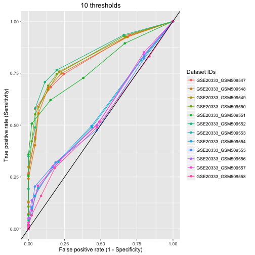

The reproducible pitch presentation
========================================================
author: gogo1988
date: August 3, 2016

Background:
========================================================

* NCBI Gene Expression Omnibus (GEO) 
contains over **1.8 millions**
 + omics samples
generated by **distinct** microarray platforms, 
 + from **different** manufacturers, 
 + each with **its own** measurement protocol, 
 + thus, omics data **can hardly** be compared 

* Receiver operating characteristic (ROC) curve
 + assess the **quality** and **appropriateness** of each GEO sample 
 + determine an **optimal** threshold value for each sample

Input:
========================================================

1. select one or multiple GEO accession IDs from the list: GSE19587, GSE20141, GSE20291, GSE20292, GSE20295, GSE20333, GSE24378, GSE53987, GSE54282, GSE7621, GSE8397")

2. provide a list of context-related manual curation (a default list is already provided)
  + ~150 active genes
  + ~40 inactive genes
  
  

Interpretation of the ROC curves:
========================================================

1. Curves **above** the baseline (the diagonal reference) indicates that, the samples (GSMs) can have a **higher** chance of predicting the true positive and false positive genes.

2. Curves that fall **along or below** the baseline indicates that, their predicting abilities could be worse than the random, and thus the samples (GSMs) have a relatively **lower** chance of predicting the genes.

Results:
========================================================

After comparing 12 retrieved GEO datasets using two different heterogeneous and homogeneous processing methods (not described here, not included in the web app), we found that: 

**Samples (GSM#’s) from the same study (GSE#) can have very different ROC curves**. For example, please see below the curves for all the samples GSMs of the dataset GSE20333. All the samples have different shapes of curves.

The Web App and its code:
========================================================

* Try the [the GEO transcriptomics data quality explorer](https://longfei.shinyapps.io/test/) now.

* The code of the App can be found at [GitHub repository](https://github.com/gogo1988/dataProduct).

